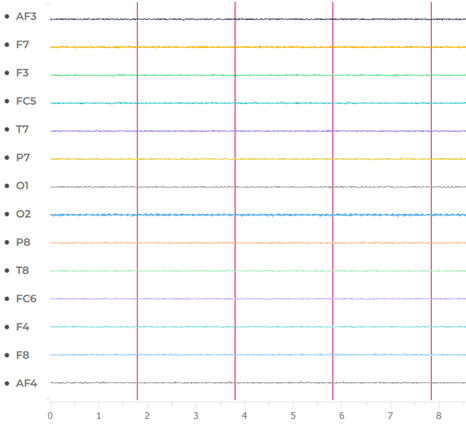
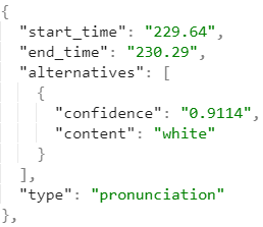

# eeg-station
## Experimental laboratory EEG software

Integrates delivery of experiments and different data capture streams:
* __Low-cost electroencephalogram (EEG):__ 14-channel EPOC X and 4-channel Muse S
* __Speech-to-text:__ verbal response analysis using neural network-based speech recognition for accurate inference and timing
* __Real-time speech recognition:__ allows to adapt the experiment parameters to the subject's responses
* __Keystrokes:__ conventional keylogger
* __Motion:__ Apple watch gyroscope and accelerometer data

Experiments
* __Stroop test:__ A) keystroke capture with 3 colours, B) 3 colours and speech, and C) 6 colours and speech
* __Arithmetic test:__ A) Boring, B) Flow (difficulty adapts), C) Overwhelming

#### EEG traces of a Muse 2 headband

#### EEG traces of an EPOC X device

#### Example of speech-to-text

