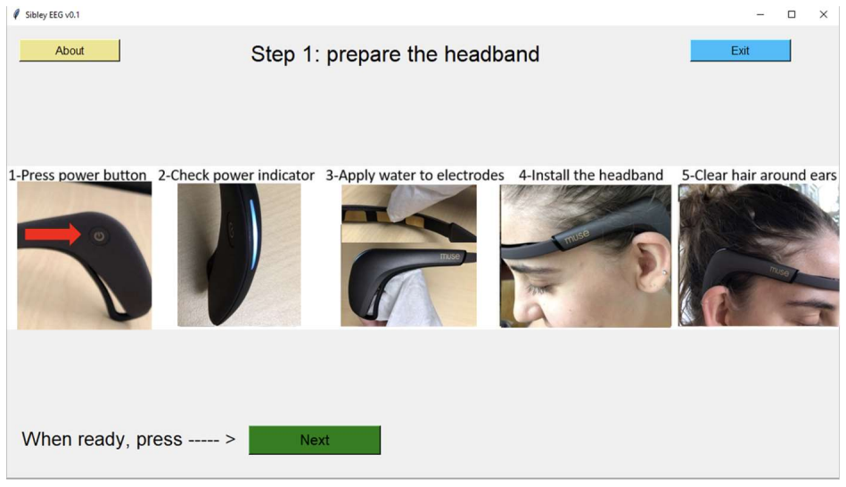
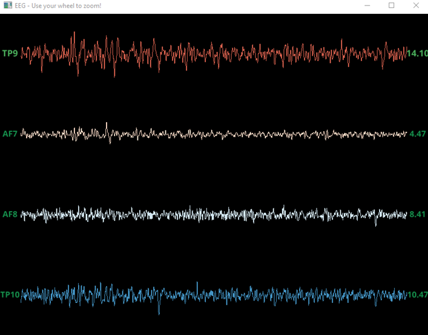

# eeg-station
## Desktop application to collect timestamped data from EEG wearables

Integrates delivery of experiments and different data capture streams:
* __Low-cost electroencephalogram (EEG):__ 14-channel EPOC X, 4-channel Muse 2 and Muse S

Experiments
* __Resting State Task:__ A) eyes closed, B) eyes open
* __Visual Oddball Task:__ A) mental count of infrequent stimuli
* __Meditation:__ A) mental relaxation

#### EEG traces of a Muse 2 headband

